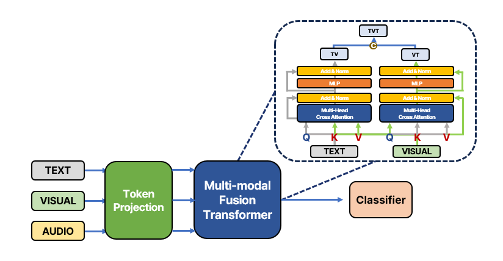

# CAAM: Cross Attention is All for Multimodal

In this research, we propose a comprehensive framework that processes visual, auditory, and textual data from videos by passing them through specialized encoders, each tailored to efficiently extract feature representations from the respective data modalities. These representations are projected into a joint embedding space through a projection head, and a **multimodal fusion transformer** is then applied to compute the **correlation between the modalities**. The resulting final embedding vector is used to perform a **classification task**, determining the video's category from a predefined set of 20 categories.

# Model Architecture

<p align="center">  </p>

The architecture of the CAAM model is designed to handle multimodal inputs—video frames, audio signals, and textual captions—by incorporating separate encoders for each modality. Each modality-specific encoder captures unique feature representations, which are then projected into a shared embedding space. Here's a breakdown of the model components:

1. **Modality Encoders**: 
   - **Video Encoder**: A vision transformer (ViT) is employed to process the frames extracted from the video. It captures spatial and temporal patterns within the video frames, encoding them into a set of feature vectors.
   - **Audio Encoder**: A GRU-based encoder processes the audio signal associated with the video, capturing the temporal dynamics in the sound.
   - **Text Encoder**: A transformer-based text encoder handles the video captions. It processes the sequential nature of the textual data, encoding the semantic meaning into feature representations.
   
2. **Joint Embedding Space**: 
   - The features extracted from each modality-specific encoder are projected into a joint embedding space through a **projection head**. This projection aligns the different modality features into a common representation space, ensuring that they can be effectively fused.

3. **Multimodal Fusion Transformer**:
   - A **multimodal fusion transformer** is employed to model the correlations between the modalities. This transformer uses cross-attention layers to allow different modalities to attend to each other. In this process, key-value pairs from one modality (e.g., video) are attended to by another modality (e.g., audio), facilitating interaction between the modalities.
   - The model includes **alternating key-value pairings** for cross-attention, where different modality pairs (video-audio, video-text, audio-text) alternately interact in successive layers. This dynamic cross-attention mechanism improves the model’s ability to capture fine-grained relationships between modalities.

4. **Classification Head**:
   - The final embedding vector produced by the fusion transformer is passed through a classification head, which is trained to predict the video’s category from 20 predefined labels.


### Architectural Insights:
- The architecture is designed to leverage the **strength of cross-modal interactions**. By allowing the modalities to interact dynamically at multiple levels through cross-attention layers, the model can better capture the interdependence of visual, auditory, and textual information.
- **Alternating cross-attention** layers provide flexibility by allowing different modality pairs to attend to each other at different levels, enhancing the model's understanding of the multimodal input.

# Dataset 
### MSR VTT ###
- Original dataset: [download](https://www.dropbox.com/sh/bd75sz4m734xs0z/AADbN9Ujhn6FZX12ulpNWyR_a?dl=0)
- Our dataset: [download](https://drive.google.com/drive/folders/1JsGZKp3ZAoC7w2XaOkZp4TnQ0GwGwUtU?usp=sharing)

The MSR-VTT dataset is one of the largest datasets designed for video captioning tasks. It contains 10,000 video clips across 20 distinct categories, with each clip annotated by 20 English sentences. For our experiments, we used 6513 clips for training and 497 clips for validation.

**We leveraged pre-extracted feature values for model training.**

# Training 
The model was trained using the following configurations: batch size of 16, 200 epochs, and an RTX 4080 16GB GPU. 
The training script is as follows:

```bash
python train.py \
--we_path 'data/GoogleNews-vectors-negative300.bin' \
--data_path 'data/msrvtt_category_train.pkl'\
--val_data_path 'data/msrvtt_category_test.pkl' \
--save_path 'weights_classifier' \
--exp trial1 \
--epoch 200 \
--use_softmax True \
--use_cls_token False \
--token_projection 'projection_net' \
--num_classes 20 \
--batch_size 16 \
--device "0"
```

# Results
We conducted experiments varying the number of cross-attention layers and modality configurations. The results are summarized below:

| Cross Attention Layers | Accuracy |                                                                   
|-------------------|------------|
| 3                 | 55.95          |    
| 6 (Fixed Keys)         | 54.66          |   
| **6 (Alternating Keys)**                 | **59.11**    |    

- **3 cross-attention layers**: Baseline with 3 layers.
- **6 cross-attention layers (Fixed Keys)**: Experiments with 3 modalities where keys and values were fixed.
- **6 cross-attention layers (Alternating Keys)**: Experiments where key values were alternately used in pairs of 2 modalities, resulting in the best accuracy.

### Results Analysis
The results indicate a clear improvement in accuracy when 6 cross-attention layers with alternating keys were applied, achieving an accuracy of **59.11%**, compared to **55.95%** with 3 layers and **54.66%** with 6 layers using fixed keys. This suggests that incorporating flexible cross-modal interactions, where different modality pairs alternately attend to each other, leads to a richer understanding of the multimodal content.

- **Alternating Keys**: This method allows for better inter-modality feature extraction by having pairs of modalities (e.g., visual and audio, visual and text) selectively attend to one another in different layers. This flexible approach enables the model to better capture cross-modal relationships, especially in complex video data where the interaction between visual, audio, and textual features is crucial.
  
- **Fixed Keys**: The experiment where the keys and values were fixed across all modalities underperformed. This suggests that fixing the keys limits the model's ability to adapt to dynamic interactions between modalities, resulting in suboptimal feature fusion.

Overall, our results demonstrate that **cross-modal attention strategies** are critical for effective multimodal learning. By dynamically alternating the attention focus between modality pairs, the model can extract more complementary and relevant features, leading to improved classification performance.

# Evaluation

The model was evaluated using several baseline methods. The following table shows performance comparisons across different models and modality combinations:

| Method                                   | Modality                                        | Acc @1%                                       | Acc @5%                                    |
|------------------------------------------|-------------------------------------------------|-----------------------------------------------|--------------------------------------------|
| ViT(video)                               | V                                               | 53.7                                          | 82.9                                       |
| GRU                                      | V                                               | 49.5                                          | 79.2                                       |
| MCA-WF(GRU)                              | V                                               | 53.8                                          | 83.8                                       |
| GRU                                      | V + T                                           | 53.1                                          | 81.8                                       |
| MCA-WF(GRU)                              | V + T                                           | 56.4                                          | 84.02                                      |
| ViLT                                     | V + T                                           | 55.4                                          | 83.9                                       |
| MCA-WF(ViLT)                             | V + T                                           | 58.8                                          | 85.3                                       |
| Ours-CA3                                 | V + T + A                                       | 55.95                                         | -                                          |
| Ours-Fix K                               | V + T + A                                       | 54.66                                         | -                                          |
| **Ours (6 Alternating Keys)**            | **V + T + A**                                   | **59.11**                                     | **-**                                      |
